# RakshaCall 🛡️

**A privacy-first, client-only, real-time scam-call protection assistant for detecting and responding to social-engineering scams.**

[](https://www.typescriptlang.org/)
[](https://react.dev/)
[](https://vitejs.dev/)
[](https://tailwindcss.com/)
[](https://vitest.dev/)
[](https://github.com/daanialmirza5/RakshaCall)
[](https://github.com/daanialmirza5/RakshaCall)

---

## 1. Project Overview

**RakshaCall** is a real-time conversational defense system engineered to protect citizens — particularly seniors, families, and everyday mobile users — from high-pressure social-engineering scams while the call is actively happening.

### The Real-World Problem
India and global telecom networks have seen an alarming surge in psychological manipulation scams:
- **"Digital Arrest" & Police/CBI Impersonation:** Fraudsters pose as law enforcement or judicial officers, alleging fabricated money-laundering or narcotics cases linked to the victim's Aadhaar or SIM. They enforce isolation (*"Do not hang up, do not tell your family"*) and demand hours on video surveillance before demanding "refundable verification deposits."
- **Fake Bank & KYC Fraud:** Callers pose as fraud-prevention teams, inducing panic about account freezing to extract OTPs or persuade victims to install remote-access software.
- **Customs & Courier Seizure:** Fake courier notices claiming a seized illegal parcel, demanding immediate "customs clearance fines."
- **SIM Deactivation Warnings:** Automated threats to block the victim's mobile number unless personal credentials and UPI PINs are disclosed immediately.
- **Investment & Task Scams:** Seemingly innocent part-time task offers that escalate into upfront deposit extortion.

Every traditional defense (bank fraud monitoring, telecom SIM-binding, SMS filters) operates **post-facto** — intervening only after funds have left the account. RakshaCall intervenes **during the manipulation**.

```
Caller Speech (Simulated Stream / Mic / Pasted Text)
        │
        ▼
Text Normalization (Unicode canonicalization, case, whitespace)
        │
        ▼
Deterministic Multi-Vector Signal Engine (8 Tactic Categories)
        │
        ▼
Co-occurrence Risk Scorer (Base weights + Stacked combination boost)
        │
        ▼
Progressive Risk Classifier: LOW (0–24)  │  MEDIUM (25–54)  │  HIGH (55–100)
        │
        ├── LOW/NORMAL  ──▶ Calm reassurance, no false alarms
        ├── MEDIUM      ──▶ Non-intrusive advisory banner
        └── HIGH        ──▶ Full-screen Emergency Takeover + Citizen Safety Guidance
```

---

## 2. Key Differentiators

1. **100% Client-Only Architecture:** Runs entirely in the user's browser runtime. No application backend server is required.
2. **Privacy-First by Design:** No audio or conversation transcripts are ever transmitted to external servers or AI APIs.
3. **Zero Cost & Zero API Dependencies:** No OpenAI/Gemini/Anthropic API keys required; immune to cloud outages, rate limits, or network lag.
4. **Deterministic & Explainable:** Transparent pattern recognition engine where every verdict links directly to specific matched social-engineering tactics.
5. **Multilingual Indian Scam Awareness:** Out-of-the-box support for English, Hinglish (romanized Hindi), Hindi (Devanagari), Marathi, and code-switched dialogues.
6. **Real-Time Progressive Detection:** Evaluates conversation dynamically as each phrase arrives, continuously updating threat scores and risk tiers.
7. **Actionable Emergency Hub:** Direct access to India's National Cyber Crime Helpline (**1930**), Cybercrime Reporting Portal (**cybercrime.gov.in**), and Telecom Fraud reporting (**Chakshu / Sanchar Saathi**).
8. **Live Runtime Workflow Observability:** Interactive graph visualizer observing real execution events across **7 distinct application workflows**.

---

## 3. How It Works

```text
┌─────────────────┐     ┌──────────────────────┐     ┌──────────────────────┐
│   Call Input    │ ──▶ │  Transcript Stream   │ ──▶ │  Text Normalization  │
└─────────────────┘     └──────────────────────┘     └──────────────────────┘
                                                                │
                                                                ▼
┌─────────────────┐     ┌──────────────────────┐     ┌──────────────────────┐
│  Risk Decision  │ ◀── │   Risk Calculation   │ ◀── │   Signal Matching    │
│(LOW/MED/HIGH)   │     │ (Weights + Combos)   │     │ (8 Tactic Vectors)   │
└─────────────────┘     └──────────────────────┘     └──────────────────────┘
        │
        ▼
┌─────────────────┐     ┌──────────────────────┐     ┌──────────────────────┐
│  Intervention   │ ──▶ │  Protection Actions  │ ──▶ │   Incident Report    │
│(Warning Overlay)│     │(Stop, SOS, 1930 Hub) │     │ (Evidence Summary)   │
└─────────────────┘     └──────────────────────┘     └──────────────────────┘
```

The workflow visualizer is connected directly to the application's runtime event bus (`src/lib/workflowRuntime.ts`). When functions execute in real time, events are emitted and displayed in the graph without fake animation loops.

---

## 4. Live Runtime Workflow Visualizer

Unlike applications that display static diagrams or mocked timer animations, RakshaCall includes an **integrated runtime observability system**.


*Figure 1: Live Call Protection Workflow observing real-time transcript streaming, signal matching, and risk evaluation.*

### Runtime Engine Architecture
- **In-Memory Event Bus (`src/lib/workflowRuntime.ts`):** Lightweight, zero-dependency publish-subscribe runtime emitting typed `WorkflowEvent` objects.
- **Instrumented Pipeline (`src/lib/workflowDrivers.ts`):** Wraps real normalization, regex signal extraction, and risk calculation functions.
- **Observability State Hook (`src/lib/useWorkflowVisualizerState.ts`):** Aggregates live node statuses (`idle`, `running`, `success`, `error`), exact durations in milliseconds, and input/output payloads.
- **Interactive Graph UI (`src/components/workflow/`):** Built with React Flow (`@xyflow/react`), rendering reactive nodes, animated edges, and a chronological execution log.

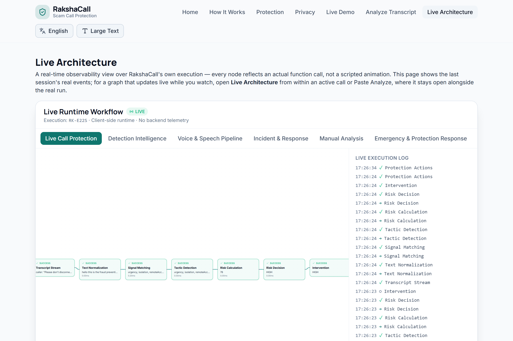
*Figure 2: Real-time Node Details panel displaying execution duration (0.42 ms), exact input text, and structured output.*

---

## 5. Multiple Observable Workflows

RakshaCall implements 7 fully instrumented workflows corresponding to every lifecycle state in the application:

| Workflow | Purpose | Verified Status |
| :--- | :--- | :---: |
| **Live Call Protection** | Observes end-to-end active call simulation, from speech to intervention | ✅ Verified |
| **Detection Intelligence** | Tracks text normalization, regex signal matching, and co-occurrence scoring | ✅ Verified |
| **Voice & Speech Pipeline** | Observes microphone SpeechRecognition, TTS synthesis, and audio activity | ✅ Verified |
| **Incident & Response** | Maps detection events into session incident logs and user responses | ✅ Verified |
| **Manual / Paste Analysis** | Observes manual text input, instant classification, and findings breakdown | ✅ Verified |
| **Emergency Response** | Traces user actions following HIGH-risk alerts (1930, Trusted Contact, Hub) | ✅ Verified |
| **Session Lifecycle** | Tracks scenario loading, playback controls, playId resets, and cleanup | ✅ Verified |

### Workflow Visualizer Gallery

| Detection Intelligence | Voice & Speech Pipeline |
| :---: | :---: |
| 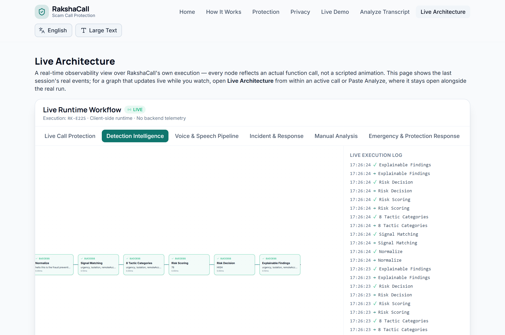 | 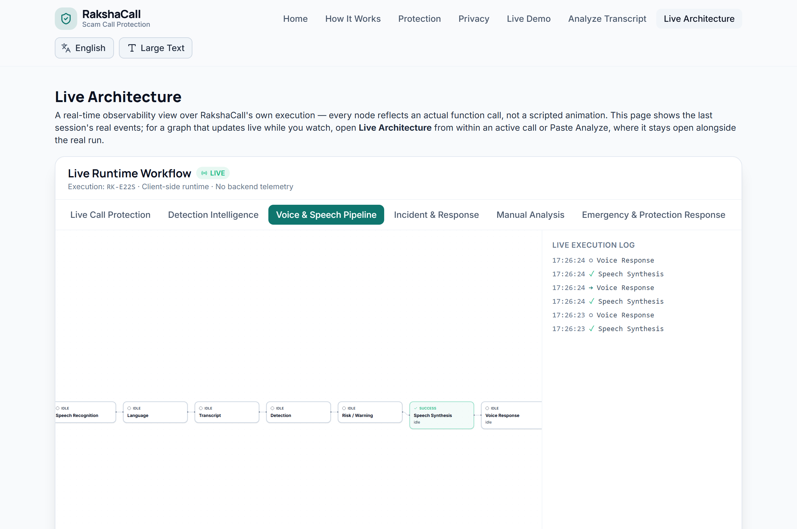 |
| *8 tactic categories & co-occurrence scoring* | *Speech recognition & speech synthesis lifecycle* |

| Incident & Response | Manual Analysis |
| :---: | :---: |
| 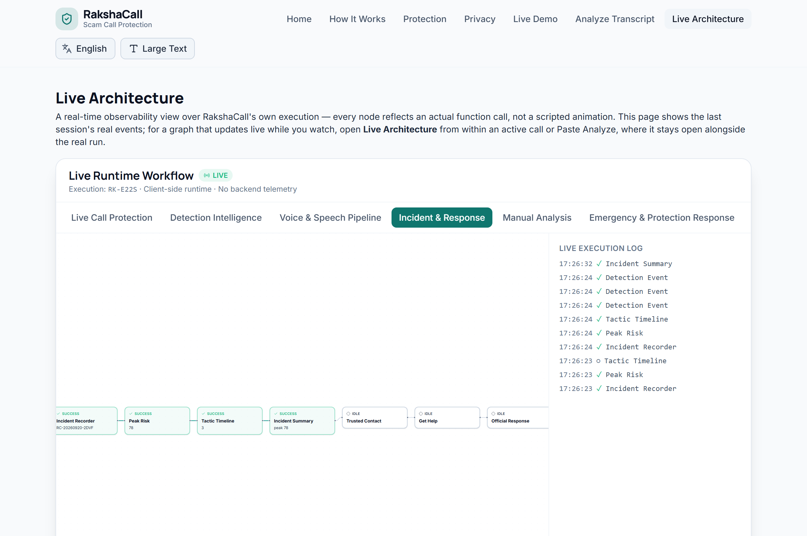 | 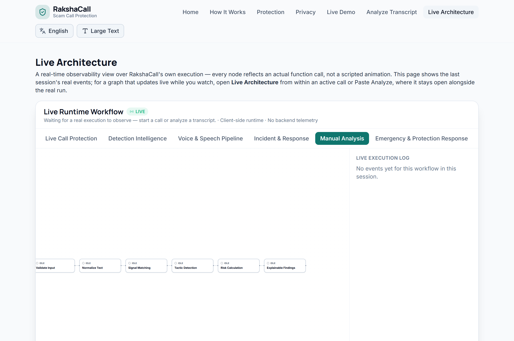 |
| *Peak risk tracking & evidence compilation* | *Instant pasted transcript evaluation* |

| Emergency & Protection Response | Session & Scenario Lifecycle |
| :---: | :---: |
| 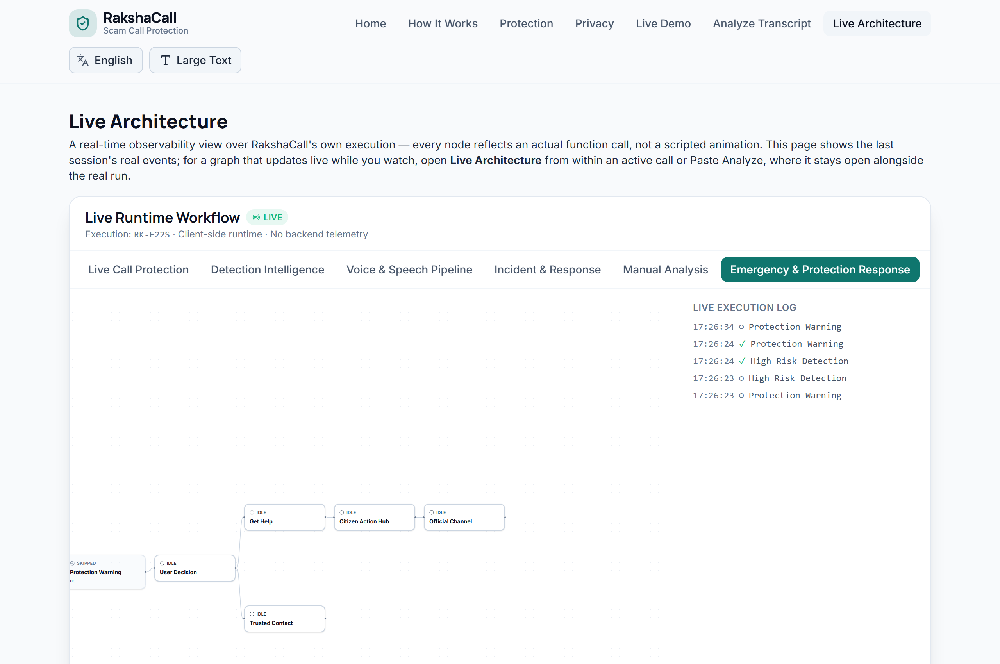 | 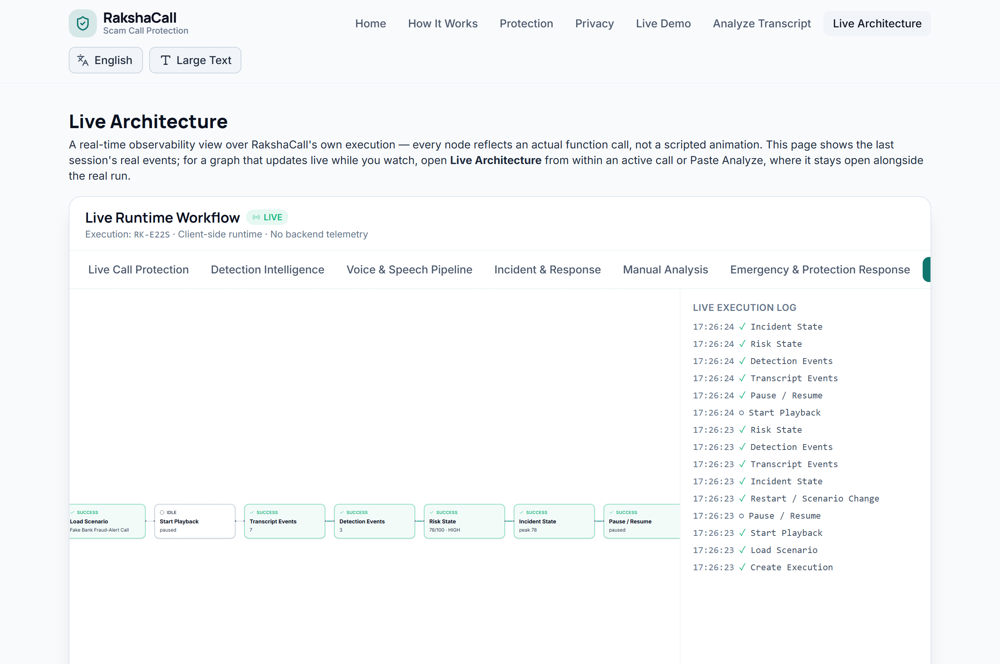 |
| *High-risk decision tree and citizen safety actions* | *Call playback state machine & cleanup* |

---

## 6. Detection Engine & Tactic Categories

The detection engine (`src/lib/detectionEngine.ts` + `src/data/signals.ts`) employs a **deterministic multi-vector rule system** modeled on documented Indian cybercrime advisories (PIB Fact Checks, RBI Consumer Awareness, Cyber Crime Police Units):

1. **Authority Impersonation (Weight: 15):** Detects claims of representing CBI, RBI, Police, TRAI, Customs, Narcotics Bureau, Supreme Court, or judicial officers.
2. **Urgency (Weight: 12):** Detects artificial panic phrasing (*"immediately"*, *"within 1 hour"*, *"last warning"*, *"do it now"*).
3. **Threat (Weight: 18):** Detects threats of arrest, non-bailable warrants, bank account freezing, asset seizure, or criminal cases.
4. **Isolation Tactics (Weight: 22):** Detects demands to stay on the line, maintain secrecy, or conceal the call from family.
5. **Video Surveillance Demands (Weight: 20):** Detects demands to keep cameras active, show room surroundings, or share screens.
6. **Credential Extraction (Weight: 25):** Detects requests for OTPs, UPI PINs, passwords, ATM PINs, or CVV numbers.
7. **Financial Extraction (Weight: 25):** Detects demands for fund transfers, refundable security deposits, verification amounts, or customs clearance fees.
8. **Remote-Access Demands (Weight: 28):** Detects instructions to install AnyDesk, TeamViewer, QuickSupport, or remote screen apps.

### Multilingual & Vernacular Support
The engine normalizes and matches phrases across:
- **English:** `"This is CBI cyber crime cell. FIR registered against your Aadhaar."`
- **Hinglish / Romanized Hindi:** `"Main police officer bol raha hu, turant paise transfer karo varna arrest ho jaoge."`
- **Hindi (Devanagari):** `"तुरंत ओटीपी बताएं, आपका बैंक खाता ब्लॉक होने वाला है।"`
- **Marathi:** `"तात्काळ पैसे ट्रान्सफर करा अन्यथा अटक वॉरंट जारी होईल."`

---

## 7. Risk Scoring & Co-occurrence Logic

Scammers rarely use a single keyword; real scams rely on **stacking tactics** (e.g. Authority + Threat + Isolation + Financial Demand).

$$\text{Final Score} = \min\left(100, \sum \text{Matched Category Weights} + \text{Co-occurrence Bonus}\right)$$

### Co-occurrence Combos
- **$\ge 2$ Categories:** $+6$ Combo Bonus
- **$\ge 3$ Categories:** $+16$ Combo Bonus
- **$\ge 5$ Categories:** $+30$ Combo Bonus

```text
Score 0 – 24   ──▶  LOW RISK     (Normal / Benign Call — Green)
Score 25 – 54  ──▶  MEDIUM RISK  (Suspicious Activity — Amber Alert)
Score 55 – 100 ──▶  HIGH RISK    (Confirmed Scam Pattern — Red Emergency Takeover)
```

---

## 8. Real-Time Protection & User Experience

| Live Call Stream & Detection | High-Risk Emergency Intervention |
| :---: | :---: |
| 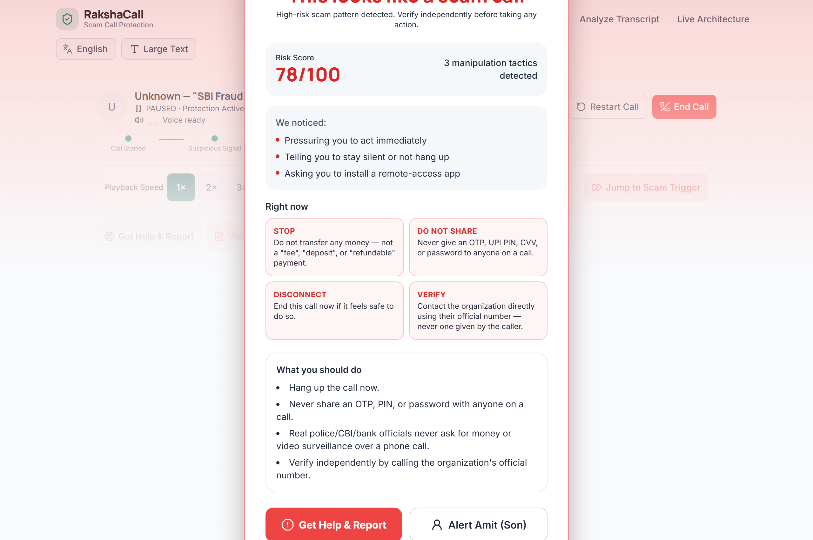 |  |
| *Dynamic risk meter climbing as manipulation tactics are detected* | *Full-screen takeover modal with clear, non-jargon guidance* |

### Actionable Intervention Checklist
When HIGH risk is detected, RakshaCall enforces 4 key rules:
- **STOP:** Take a breath; real government and police agencies do not conduct investigations over WhatsApp or phone calls.
- **DO NOT SHARE:** Never disclose OTPs, UPI PINs, or passwords under any circumstance.
- **DISCONNECT:** Hang up immediately; disconnect video calls and do not comply with remote-access installation requests.
- **VERIFY:** Check independently through official, verified phone numbers or local branch offices.

---

## 9. Emergency Response & Official Helplines

RakshaCall connects users directly to verified citizen safety resources:

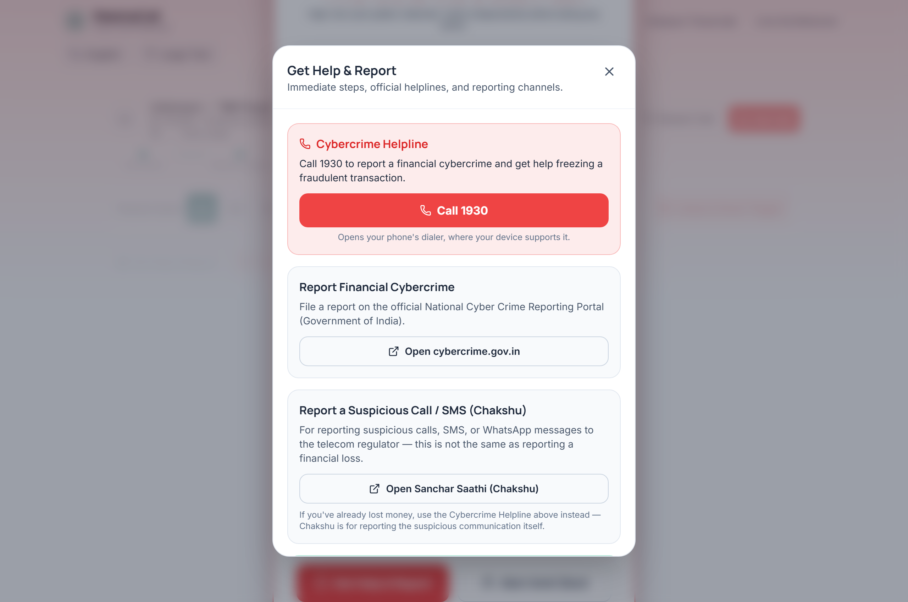
*Figure 3: Citizen Action Hub with verified Indian official channels.*

- **National Cyber Crime Helpline (1930):** Direct telephone link (`tel:1930`) for immediate financial fraud intervention.
- **National Cyber Crime Reporting Portal:** Official website link to [cybercrime.gov.in](https://cybercrime.gov.in).
- **Chakshu Facility (Sanchar Saathi):** Official link to report suspected fraudulent calls and SMS messages on [sancharsaathi.gov.in](https://sancharsaathi.gov.in).

> **Important Disclosure:** RakshaCall provides direct guidance and verified links. It does not claim to automatically submit complaints or contact authorities on the user's behalf.

---

## 10. Simulated Trusted Contact & Incident Summary

| Trusted Contact SOS Alert | Session Incident Summary |
| :---: | :---: |
| 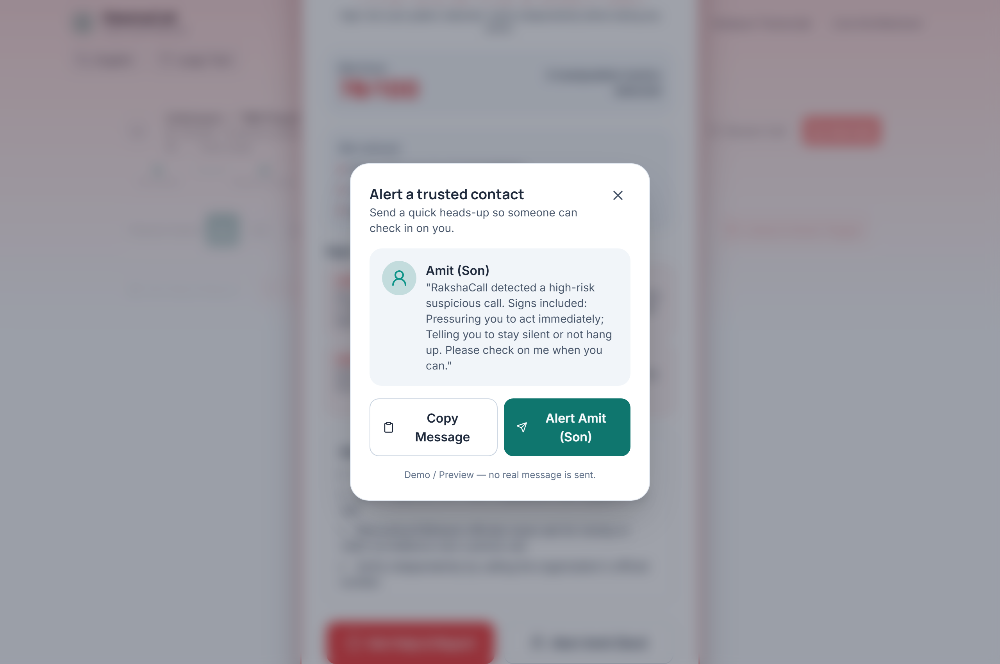 | 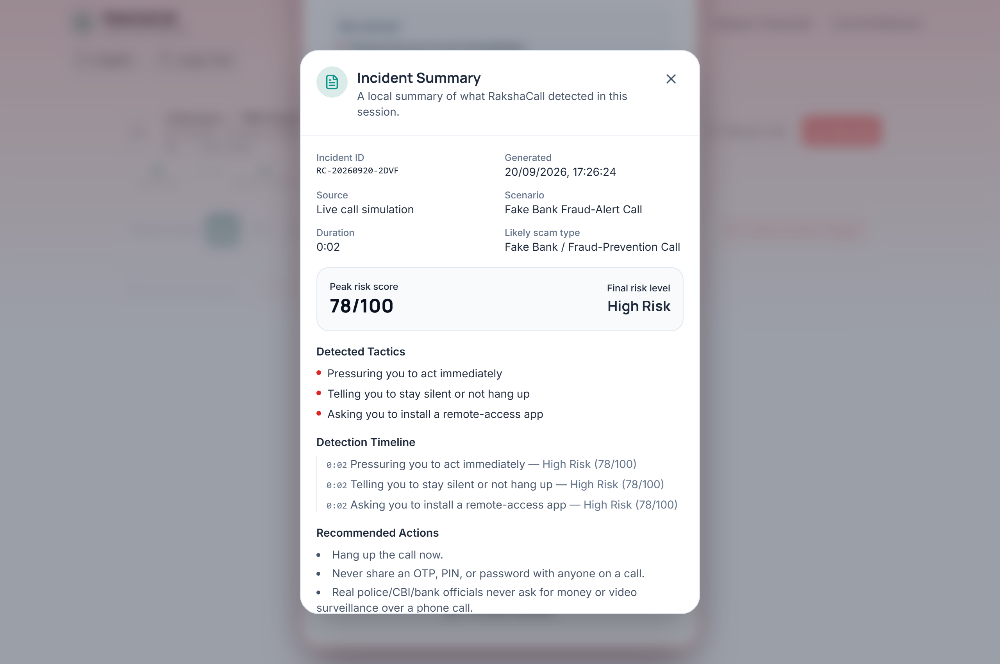 |
| *One-tap alert dispatch to designated family contact* | *Exportable incident summary with timeline and peak score* |

- **Trusted Contact SOS:** Formulates a safe, plain-language check-in message built from detected tactics. (Clearly labeled simulated preview — no raw conversation transcript is transmitted).
- **Incident Summary:** Compiles session metrics (Peak Risk Score, Likely Scam Type, Matched Tactic Timeline) with one-click **Copy to Clipboard** and **Download Text Report** functionality.

---

## 11. Mobile Experience

RakshaCall is fully responsive across mobile viewports (320px, 390px, 768px, and desktop):

| Mobile Landing View | Mobile Runtime Workflow |
| :---: | :---: |
| 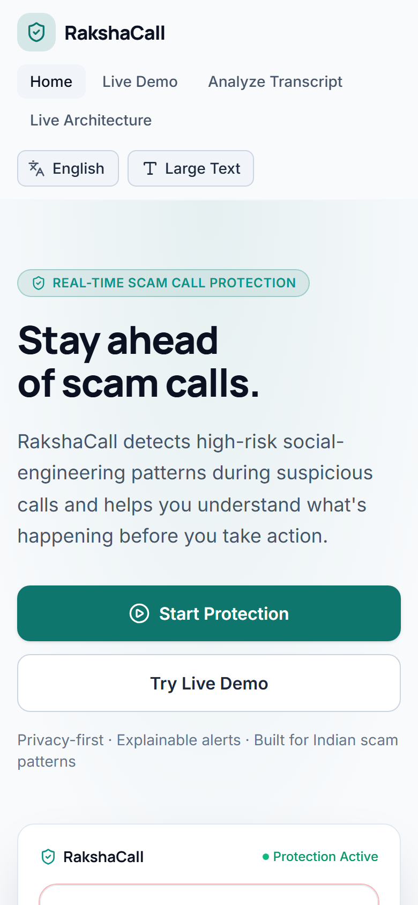 | 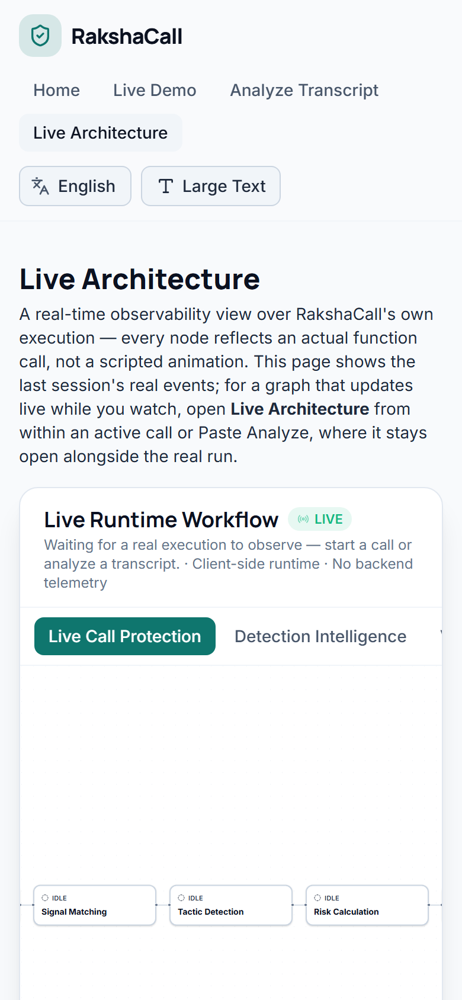 |
| *Clean mobile navigation and high-contrast alert design* | *Interactive touch-enabled workflow graph* |

---

## 12. Privacy Architecture

- **Zero Application Backend:** No server, database, or cloud infrastructure receives conversation data.
- **Local Synchronous Analysis:** Text normalization, regex scanning, and scoring run inside the client JavaScript runtime in $<1\text{ ms}$.
- **Transparent Speech Input Disclosure:** Browser SpeechRecognition uses native browser capabilities. Audio processing depends on browser vendor implementations (e.g. Chrome may use browser vendor speech services). RakshaCall never sends voice audio to any RakshaCall server.
- **No Account or Personal Tracking:** No tracking cookies, login credentials, or user telemetry.

---

## 13. Technology Stack

- **Core:** React 19, TypeScript 6, Vite 8
- **Styling:** Tailwind CSS v4, Framer Motion
- **Icons & Visuals:** Lucide React
- **Workflow & Observability:** `@xyflow/react` (React Flow)
- **Speech APIs:** Native Browser Web Speech API (`SpeechRecognition` & `SpeechSynthesis`)
- **Testing:** Vitest 5, `@testing-library/react`, `jsdom`
- **Linter:** `oxlint`

---

## 14. Project Structure

```text
RakshaCall/
├── docs/
│   ├── demo/
│   │   ├── RakshaCall-Demo.mp4        # High-definition demo recording
│   │   └── RakshaCall-Demo.webp       # Animated lightweight preview
│   └── screenshots/                   # Complete high-res screenshot suite
│       ├── 01-landing-page.png
│       ├── 02-live-call-start.png
│       ├── 03-live-call-transcript.png
│       ├── 04-live-call-detection.png
│       ├── 05-risk-warning.png
│       ├── 06-live-runtime-workflow.png
│       ├── 07-workflow-node-details.png
│       ├── 08-detection-intelligence-workflow.png
│       ├── 09-voice-speech-workflow.png
│       ├── 10-incident-response-workflow.png
│       ├── 11-manual-analysis-workflow.png
│       ├── 12-emergency-workflow.png
│       ├── 13-session-lifecycle-workflow.png
│       ├── 14-incident-summary.png
│       ├── 15-trusted-contact.png
│       ├── 16-emergency-action-hub.png
│       ├── 17-mobile-view.png
│       └── 18-mobile-workflow.png
├── public/                            # Static assets (favicons, SVGs)
├── src/
│   ├── components/                    # UI Components
│   │   ├── workflow/                  # Live Runtime Workflow visualizer
│   │   │   ├── WorkflowGraphNode.tsx  # Custom React Flow node with status badges
│   │   │   ├── WorkflowVisualizer.tsx # Multi-workflow tabbed visualizer & execution log
│   │   │   └── workflowLayout.ts      # Deterministic graph coordinate layout engine
│   │   ├── CallScreen.tsx             # Active call simulation interface
│   │   ├── CitizenActionHub.tsx       # Emergency helpline 1930 & reporting guide
│   │   ├── IncidentReportModal.tsx    # Forensic incident summary card
│   │   ├── Landing.tsx                # Hero, trust strip, and features overview
│   │   ├── PasteAnalyze.tsx           # Manual text / speech transcription tester
│   │   ├── PlaybackControls.tsx       # 1x/2x/3x speed, jump trigger, and playback state
│   │   ├── RiskMeter.tsx              # Progressive animated score gauge
│   │   ├── TacticsList.tsx            # Categorized scam badges
│   │   ├── TrustedContactPanel.tsx    # Emergency contact notification preview
│   │   └── WarningOverlay.tsx         # Full-screen high-risk intervention takeover
│   ├── data/
│   │   ├── scenarios.ts               # Realistic scam & benign call dialogue streams
│   │   └── signals.ts                 # 8 category regex patterns (EN, Hinglish, HI, MR)
│   ├── i18n/
│   │   ├── LanguageContext.tsx        # Vernacular language provider (EN, HI, MR)
│   │   └── strings.ts                 # Multilingual UI copy and guidance dictionaries
│   └── lib/                           # Logic & Engines
│       ├── detectionEngine.ts         # Deterministic regex matcher and risk scorer
│       ├── incidentReportUtils.ts     # Incident data generation and report formatting
│       ├── speechRecognition.ts       # Web Speech API speech-to-text integration
│       ├── speechSynthesis.ts         # Browser speech synthesis voice engine
│       ├── textNormalize.ts           # Text canonicalization and punctuation handling
│       ├── useCallPlayback.ts         # Call stream timer and playback controller
│       ├── useCallVoice.ts            # Dynamic voice playback synchronization hook
│       ├── useIncidentReport.ts       # Live incident state derivation hook
│       ├── useWorkflowVisualizerState.ts # Real-time workflow state subscriber hook
│       ├── workflowDefinitions.ts     # 7 registered workflow node/edge topologies
│       ├── workflowDrivers.ts         # Instrumented function execution wrappers
│       ├── workflowObservers.ts       # Runtime observation adapters
│       └── workflowRuntime.ts         # Pure in-memory runtime event bus
├── package.json
├── tsconfig.json
└── vite.config.ts
```

---

## 15. Testing & Quality Assurance

All 203 unit and integration tests across 13 test suites pass cleanly:

```text
✓ src/lib/detectionEngine.test.ts (63 tests)
✓ src/lib/useCallVoice.test.ts (13 tests)
✓ src/lib/useCallPlayback.test.ts (12 tests)
✓ src/lib/useIncidentReport.test.ts (7 tests)
✓ src/lib/useWorkflowVisualizerState.test.ts (7 tests)
✓ src/lib/speechRecognition.test.ts (10 tests)
✓ src/lib/callPlaybackUtils.test.ts (16 tests)
✓ src/lib/incidentReportUtils.test.ts (16 tests)
✓ src/lib/workflowDrivers.test.ts (8 tests)
✓ src/lib/workflowRuntime.test.ts (14 tests)
✓ src/lib/speechSynthesis.test.ts (23 tests)
✓ src/lib/textNormalize.test.ts (7 tests)
✓ src/components/workflow/workflowLayout.test.ts (7 tests)

Test Files  13 passed (13)
     Tests  203 passed (203)
```

---

## 16. Demo Video

A full demonstration video of RakshaCall is recorded and included in the repository:

- 📹 **Demo Video (MP4):** [docs/demo/RakshaCall-Demo.mp4](docs/demo/RakshaCall-Demo.mp4)
- 🎬 **Demo Preview (WebP):** [docs/demo/RakshaCall-Demo.webp](docs/demo/RakshaCall-Demo.webp)

---

## 17. 2-Minute Hackathon Demo Flow

1. **Landing Page:** Open RakshaCall and review the problem statement and client-side privacy model.
2. **Start Protection:** Select the *Fake "Digital Arrest" — CBI Impersonation* scenario.
3. **Live Streaming & Detection:** Set speed to `2x` and observe the Risk Meter climbing as authority, threat, and isolation tactics appear.
4. **Scam Escalation:** Watch the score cross 55 into **HIGH RISK**, triggering the emergency intervention takeover.
5. **Actionable Response:** Inspect the STOP guidance, test the simulated **Alert Amit (Son)** SOS, and review the **Citizen Action Hub (1930 Helpline)**.
6. **Incident Summary:** View the incident report card showing the peak risk score and chronological detection timeline.
7. **Live Runtime Workflow:** Open the **Live Architecture** visualizer and explore the 7 observable execution graphs with live timestamps and execution durations.

---

## 18. Local Setup & Execution

### Prerequisites
- Node.js 18+ installed

### Installation & Run
```bash
# Clone the repository
git clone https://github.com/daanialmirza5/RakshaCall.git
cd RakshaCall

# Install dependencies
npm install

# Start local development server
npm run dev

# Run unit and integration tests
npm run test:run

# Build production bundle
npm run build
```

---

## 19. Limitations

- **Deterministic Rule-Based Detection:** Identifies known social-engineering phrasings and their combinations; novel phrasing variations may require pattern updates.
- **No Direct GSM Interception:** This MVP analyzes streamed scenario dialogues, microphone input, or pasted text; it does not intercept cellular phone calls.
- **Browser Speech-to-Text Dependency:** Speech recognition capability depends on browser support (Chromium-based browsers recommended).
- **Session-Only Persistence:** Incident reports and state are maintained in-memory for the current browser session only.

---

## 20. Disclaimer

RakshaCall is an open-source hackathon safety-assistance application built for educational and harm-reduction demonstration purposes. It does not replace official emergency services, commercial banking fraud systems, telecom security filters, or law enforcement authorities. If you suspect you are a victim of financial cybercrime, dial **1930** or visit **[cybercrime.gov.in](https://cybercrime.gov.in)** immediately.
