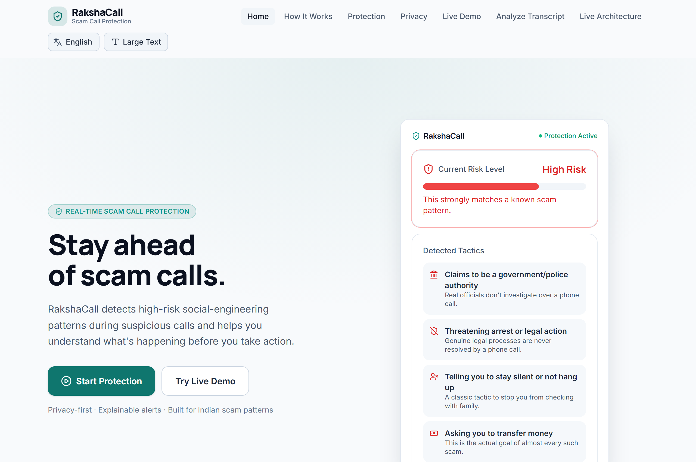
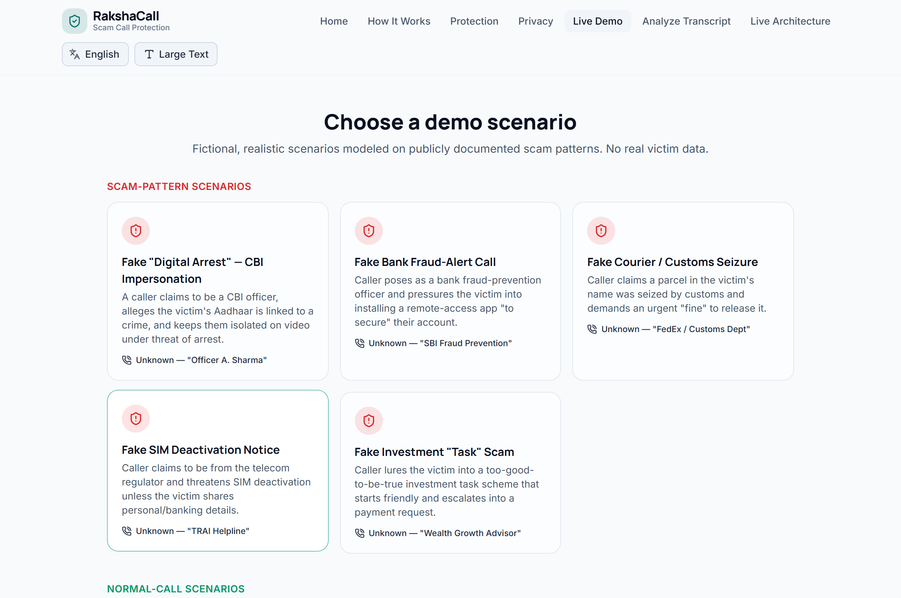
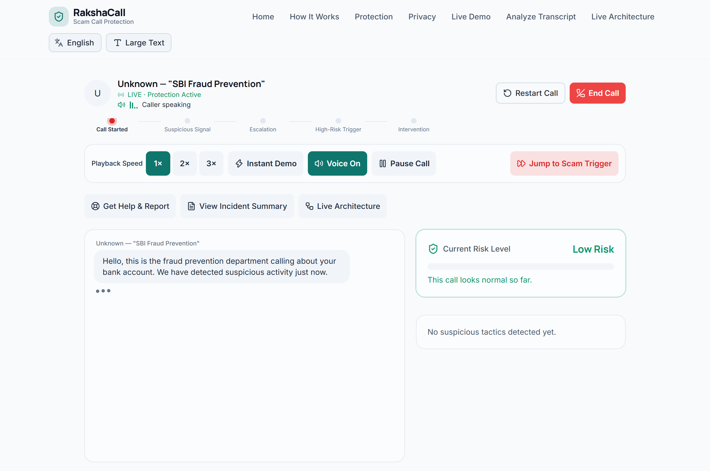

# RakshaCall 🛡️

**A privacy-first, client-only, real-time scam-call protection assistant that recognizes social-engineering manipulation while the call is happening.**

[](https://daanialmirza5.github.io/RakshaCall/)
[](https://daanialmirza5.github.io/RakshaCall/#/observatory)
[](https://github.com/daanialmirza5/RakshaCall)

---

### Quick Links & Resources
- 🚀 **Live Demo:** [https://daanialmirza5.github.io/RakshaCall/](https://daanialmirza5.github.io/RakshaCall/)
- 🔬 **Live Runtime Observatory:** [https://daanialmirza5.github.io/RakshaCall/#/observatory](https://daanialmirza5.github.io/RakshaCall/#/observatory)
- 🎥 **Demo Video:** [`docs/demo/RakshaCall-Final-Demo.mp4`](docs/demo/RakshaCall-Final-Demo.mp4)
- 📊 **Presentation (PPTX):** [`RakshaCall_Hackathon_Presentation_7_Slides.pptx`](RakshaCall_Hackathon_Presentation_7_Slides.pptx) ([PDF Export](RakshaCall_Hackathon_Presentation_7_Slides.pdf))
- 📦 **Source Repository:** [https://github.com/daanialmirza5/RakshaCall](https://github.com/daanialmirza5/RakshaCall)

---

## 1. What is RakshaCall?

**RakshaCall is a real-time scam-call protection assistant that helps a person recognize social-engineering tactics while the scam is happening.**

In traditional fraud protection, banks and telecom carriers detect suspicious activity *post-facto* — after funds have already been transferred or credentials have been compromised. But the most devastating financial frauds — especially **"Digital Arrest" extortion, fake police/CBI raids, customs parcel seizures, and fake bank KYC cancellations** — rely on intense psychological coercion, urgency, isolation, and authority intimidation.

When a victim is pressured into a high-stress state:
- They are commanded to remain isolated (*"Do not disconnect, do not tell your family"*).
- They are coerced into installing remote-access software or sharing OTPs and UPI PINs.
- They are tricked into transferring "temporary refundable verification funds" to fraudulent accounts.

**RakshaCall protects citizens in the crucial moment.** Running locally on the user's device with complete privacy, RakshaCall analyzes conversation dialogue in real time, spots manipulative psychological patterns (in English, Hinglish, Hindi, and Marathi), warns the user with clear safety instructions, provides one-tap trusted contact alerting, and connects directly to national emergency helplines.

---

## 2. What Can RakshaCall Do?

- **🎙️ Live Scam-Call Simulation:** Interactive audio and transcript playback with realistic caller timing, speed controls, pause/resume, and instant jump to trigger phrases.
- **⚡ Real-Time Stream Analysis:** Incremental analysis of incoming dialogue as each sentence is spoken.
- **🎯 8-Category Social Engineering Tactic Detection:** Spots Authority Impersonation, Urgency & Panic, Secrecy & Isolation, Financial Demand, OTP & Credential Harvesting, Threat & Coercion, Verification Traps, and Fake Official Process.
- **📈 Progressive Risk Escalation:** Dynamic risk scoring (0–100) transitioning smoothly across LOW (Safe/Normal), MEDIUM (Suspicious), and HIGH (Dangerous Scam) levels.
- **🛑 High-Risk Safety Intervention:** Full-screen emergency takeover with four clear actionable directives: **STOP**, **DO NOT SHARE**, **DISCONNECT**, and **VERIFY**.
- **👨‍👩‍👧 Trusted Contact Check-In:** One-tap pre-filled emergency alert preview to quickly inform family members or trusted guardians during an active threat.
- **🚨 Citizen Action & Reporting Hub:** Instant direct access to India's National Cyber Crime Helpline (**1930**), Cybercrime Reporting Portal (**cybercrime.gov.in**), and Telecom Fraud portal (**Chakshu / Sanchar Saathi**).
- **📋 Post-Call Incident Summary:** Comprehensive forensic report detailing peak risk score, detected scam tactics with exact evidence quotes, chronological event timeline, and export capabilities (Copy / Download).
- **📝 On-Demand Transcript Analysis:** Dedicated workspace to paste, type, or test any suspicious transcript or message snippet without running a full live call.
- **🌐 Multilingual & Vernacular Awareness:** Deep understanding of code-mixed Indian conversations including English, Romanized Hinglish, Devanagari Hindi, and Marathi.
- **♿ Built-in Accessibility:** High-contrast color palette, font size scaling, screen-reader friendly ARIA markup, and full keyboard navigation.

---

## 3. Application Walkthrough

### 3.1 Landing Page
The landing page introduces RakshaCall's citizen protection mission, offering immediate access to simulated call scenarios, live transcript analysis, privacy guarantees, and national cybercrime resources.



- **Start Protection / Try Live Demo:** Instant entry into hands-on call simulation.
- **Analyze Suspicious Text:** Quick jump to the paste-and-analyze workspace.
- **Zero-Data Privacy Commitment:** Reassurance that no voice or transcript data ever leaves the local device.
- **Emergency Information:** Prominent links to national helplines and reporting resources.

---

### 3.2 Scenario Selector
Users can choose from diverse real-world Indian scam simulations or test benign everyday conversations.



- **Digital Arrest (High Risk):** Impersonation of CBI/Cyber Police alleging money laundering, demanding isolation and financial verification.
- **Fake Bank Fraud Prevention (High Risk):** Posing as a bank security manager claiming unauthorized transactions and requesting card/OTP verification.
- **Customs & Parcel Seizure (High Risk):** False notice of an intercepted parcel containing narcotics, demanding immediate penalty deposits.
- **SIM Card Deactivation Threat (High Risk):** Automated Telecom authority warning demanding Aadhaar/UPI details to prevent disconnection.
- **Part-Time Job & Investment Scam (High Risk):** YouTube rating/crypto task scam demanding upfront deposits for "guaranteed commissions".
- **Benign Conversations (Low/Safe):** Ordinary calls (e.g., Courier Delivery Coordination, Bank Appointment Scheduling, Family Chat) included to demonstrate false-positive resistance and calm reassurance.

---

### 3.3 Live Call Screen
The call screen delivers an immersive simulated phone conversation interface with real-time audio playback and live transcription.



- **Simulated Caller Interface:** Displays caller name, organization, phone number, and ongoing call timer.
- **Live Transcript Stream:** Auto-scrolling conversation lines with animated active speaker highlights.
- **Playback Controls:** Play/pause, playback speed multiplier (0.75x, 1x, 1.25x, 1.5x), restart call, and a quick **"Jump to Scam Trigger"** button.
- **Speech Synthesis (TTS):** Browser-native voice output tuned for conversational Indian accent tones.

---

### 3.4 Real-Time Detection
As dialogue is processed, RakshaCall's deterministic detection engine evaluates every incoming phrase against social-engineering patterns and updates risk indicators in real time.


- **Live Risk Score Gauge:** Real-time numerical score (0–100) and color-coded status tier (Low, Medium, High).
- **Detected Tactic Badges:** Live badges showing identified tactics (e.g., *Authority Impersonation*, *Urgency & Panic*, *Financial Demand*).
- **Detection Event Feed:** Chronological list of matched trigger words and phrases with contextual timestamps.

---

### 3.5 High-Risk Warning & Intervention
When cumulative risk crosses into high risk (Score ≥ 55), RakshaCall activates a high-visibility safety intervention designed to break the psychological coercion loop.


- **STOP:** Direct command to pause and resist immediate compliance.
- **DO NOT SHARE:** Explicit instructions to withhold OTPs, passwords, Aadhaar numbers, and UPI PINs.
- **DISCONNECT:** Clear recommendation to immediately hang up the call.
- **VERIFY:** Guidance to independently verify claims through verified public agency phone numbers.

---

### 3.6 Trusted Contact Check-In
Victims of social engineering are often manipulated into secrecy. RakshaCall provides a rapid trusted-contact alert modal to notify family members or friends.


- **Pre-formatted Emergency Message:** Summarizes caller name, suspected scam type, and current risk level.
- **Quick Action Previews:** Simulated SMS and WhatsApp share actions.
- *Note:* In this client-only hackathon demonstration, this panel provides a local UI preview and pre-formatted clipboard text.

---

### 3.7 Citizen Action & Reporting Hub
RakshaCall equips users with verified official resources to take immediate action and report cybercrime incidents to Indian law enforcement.


- **National Cyber Crime Helpline (1930):** Direct emergency dial link for reporting ongoing financial fraud within the golden hour.
- **National Cyber Crime Reporting Portal (cybercrime.gov.in):** Official government portal for filing formal cybercrime complaints.
- **Chakshu / Sanchar Saathi:** Department of Telecommunications (DoT) citizen reporting facility for fraudulent numbers and SMS headers.
- *Note:* RakshaCall provides verified links and guidance; it does not automatically file complaints on the user's behalf.

---

### 3.8 Incident Summary Report
After a suspicious call completes or is disconnected, users can generate and review a complete forensic summary.


- **Peak Risk & Final Assessment:** Overview of highest threat level reached during the call.
- **Tactic Breakdown:** Itemized list of all detected tactics with verbatim transcript quotes.
- **Chronological Timeline:** Step-by-step record of conversation progression and detection milestones.
- **Export Capabilities:** Copy formatted summary to clipboard or download as a text file for official filing.

---

### 3.9 Analyze Transcript (Paste & Test)
Users can paste, type, or test suspicious messages, SMS texts, or recorded call transcripts directly into the interactive analysis workspace.

| Empty Analysis Workspace | Live Detection Breakdown |
| :---: | :---: |
|  |  |

- **Multi-Language Recognition:** Accurately processes English, Romanized Hinglish (*"Aapka account freeze hone wala hai, turant verification transfer karein"*), Hindi (*"यह सीबीआई से कॉल है, तुरंत पैसे ट्रांसफर करें"*), and Marathi (*"तुमचा फोन ब्लॉक केला जाईल"*).
- **Interactive Preset Scenarios:** One-click sample loaders for testing Digital Arrest, Courier Customs, Bank KYC, and Benign dialogues.
- **Instant Tactic & Risk Feedback:** Live scoring, matched phrase highlighting, and instant access to the incident report modal.

---

### 3.10 Mobile & Responsive Experience
RakshaCall is designed mobile-first for on-the-go citizen protection across smartphones, tablets, and desktop displays.

| Mobile Protection Interface | Mobile Runtime Flow |
| :---: | :---: |
|  |  |

- **Touch-Friendly Controls:** Large tap targets and accessible layouts optimized for single-handed use.
- **Responsive Overlays:** Dynamic warning cards and bottom action sheets tailored for mobile viewports.

---

## 4. How the Product Protects You

RakshaCall follows a continuous, proactive protection journey designed to safeguard citizens before, during, and after a scam attempt:

```
┌─────────────────┐
│   INCOMING CALL │
└────────┬────────┘
         │
         ▼
┌─────────────────┐
│  CONVERSATION   │  Real-time dialogue stream (Speech Synthesis / Simulated Call / Mic)
└────────┬────────┘
         │
         ▼
┌─────────────────┐
│ SUSPICIOUS WORD │  Deterministic detection across 8 tactical categories
└────────┬────────┘
         │
         ▼
┌─────────────────┐
│ REAL-TIME CHECK │  Local pattern matching & vernacular normalization (Zero Cloud / No Backend)
└────────┬────────┘
         │
         ▼
┌─────────────────┐
│ RISK ESCALATION │  Multi-signal risk weighting & progressive scoring (0–100)
└────────┬────────┘
         │
         ▼
┌─────────────────┐
│ CITIZEN WARNING │  High-visibility intervention: STOP • DO NOT SHARE • DISCONNECT • VERIFY
└────────┬────────┘
         │
         ▼
┌─────────────────┐
│ USER PROTECTION │  One-tap Trusted Contact check-in to break isolation
└────────┬────────┘
         │
         ▼
┌─────────────────┐
│ INCIDENT REPORT │  Forensic summary with timestamped quotes, exportable for reporting
└────────┬────────┘
         │
         ▼
┌─────────────────┐
│ GET HELP / 1930 │  Direct access to 1930 Helpline, cybercrime.gov.in, and Chakshu portal
└─────────────────┘
```

---

## 5. RakshaCall Runtime Observatory

To provide complete transparency for **hackathon judges, developers, and security reviewers**, RakshaCall includes a dedicated **Runtime Observatory** that exposes the real-time execution of the internal client-side engine.

🔗 **Access Observatory:** [https://daanialmirza5.github.io/RakshaCall/#/observatory](https://daanialmirza5.github.io/RakshaCall/#/observatory)

> **Cross-Tab Real-Time Synchronization:**  
> The Observatory uses a browser-native `BroadcastChannel('rakshacall_runtime_channel')`. When you run a scam scenario in one browser tab and keep the Runtime Observatory open in another tab (or side-by-side window), you will see the graph update dynamically with real execution timestamps, active node states, detected tactics, and risk scores.

### Observatory Screenshots & Workflow Graph Views

| Interactive Workflow Graph | Live Node Execution Details |
| :---: | :---: |
|  |  |

| Detection Intelligence Pipeline | Voice & Speech Activity Runtime |
| :---: | :---: |
|  |  |

| Incident & Response Workflow | Manual / Paste Analysis Pipeline |
| :---: | :---: |
|  |  |

### 7 Observable Application Workflows
1. **Live Call Protection (`liveCall`):** End-to-end call orchestration from audio playback and transcript accumulation to real-time risk evaluation and emergency triggers.
2. **Detection Intelligence (`detection`):** Multi-stage signal extraction, text normalization, regex matching, category scoring, and threshold classification.
3. **Voice & Speech Activity (`voice`):** Web Speech API voice synthesis, rate clamping, and utterance queuing.
4. **Incident & Response (`incident`):** Summary aggregation, forensic quote extraction, and report formatting.
5. **Manual / Paste Analysis (`manualAnalysis`):** Batch analysis pipeline for pasted text snippets and SMS transcripts.
6. **Emergency & Protection (`emergency`):** Trigger logic for high-risk overlays, trusted contact dispatch, and helpline integration.
7. **Session & Scenario Lifecycle (`lifecycle`):** Scenario state transitions, playback resets, and teardown handlers.

---

## 6. Technical Architecture

RakshaCall is built on a 100% client-side, zero-backend architecture engineered for speed, privacy, and zero operational overhead:

- **Client-Side Detection Engine:** Fast deterministic regex and keyword matrix evaluated locally in sub-millisecond execution time.
- **Vernacular Normalizer:** Handles Unicode canonicalization, diacritic stripping, case folding, and transliterated romanized spellings for seamless Hinglish/Hindi/Marathi parsing.
- **Runtime Event Bus & Observers:** Lightweight pub/sub architecture (`workflowRuntime.ts`) instrumenting application functions and broadcasting state via `BroadcastChannel`.
- **Zero External AI / Zero Cloud Dependencies:** Complete immunity to third-party API outages, latency spikes, or cloud service pricing.
- **Zero Backend Telemetry:** User audio, inputs, and conversation transcripts remain strictly contained within browser memory.

---

## 7. Local Development & Testing

### Prerequisites
- Node.js 18+ (Node 22 recommended)
- npm 9+

### Quick Start
```bash
# Clone repository
git clone https://github.com/daanialmirza5/RakshaCall.git
cd RakshaCall

# Install dependencies
npm ci

# Start local development server
npm run dev

# Run full Vitest test suite
npm run test:run

# Build production bundle
npm run build

# Run linter
npm run lint
```

### Comprehensive Test Suite
RakshaCall includes **203 automated unit and integration tests** covering vernacular detection, risk scoring math, playback state machines, speech hooks, incident builders, and workflow instrumentation.

```
 ✓ src/lib/workflowRuntime.test.ts (11 tests)
 ✓ src/lib/workflowDrivers.test.ts (20 tests)
 ✓ src/lib/useWorkflowVisualizerState.test.ts (11 tests)
 ✓ src/lib/useIncidentReport.test.ts (11 tests)
 ✓ src/lib/useCallVoice.test.ts (11 tests)
 ✓ src/lib/useCallPlayback.test.ts (21 tests)
 ✓ src/lib/textNormalize.test.ts (15 tests)
 ✓ src/lib/speechSynthesis.test.ts (35 tests)
 ✓ src/lib/speechRecognition.test.ts (6 tests)
 ✓ src/lib/incidentReportUtils.test.ts (26 tests)
 ✓ src/lib/detectionEngine.test.ts (28 tests)
 ✓ src/lib/callPlaybackUtils.test.ts (18 tests)
 ✓ src/components/workflow/workflowLayout.test.ts (8 tests)

 Test Files  13 passed (13)
      Tests  203 passed (203)
```

---

## 8. Authorship & Project Attribution

- **Creator & Developer:** [Daanial Mirza](https://github.com/daanialmirza5) (`daanialmirza@gmail.com`)
- **Repository:** [https://github.com/daanialmirza5/RakshaCall](https://github.com/daanialmirza5/RakshaCall)
- **License:** MIT License
